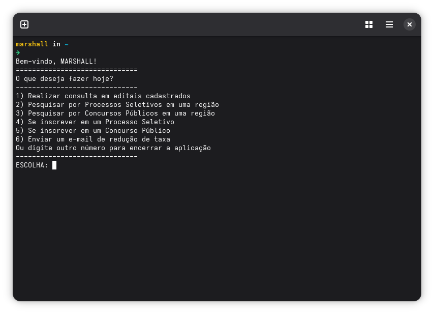

# CPS-KIT
Automação de Inscrições e Monitoramento de Processos Seletivos e Concursos Públicos do CPS (Centro Paula Souza).


*Tela inicial da aplicação*


## Funcionalidades
- Scrapping do Diário Oficial do Estado de SP para monitoramento dos editais
- Inscrição automatizada em PSS e CPD via Selenium
- Preenchimento automático de PDFs e envio de documentação por e-mail

## Estrutura

```
├── doe/        # Módulo de scrapping do Diário Oficial
├── filtro/     # Módulo de pesquisa para PSS e CPD válidos
├── inscricao/  # Módulo de inscrição via Selenium
├── taxa/       # Módulo de preenchimento e envio de solicitação de isenção
├── .env        # Variáveis de ambiente (não versionado)
├── app.py      # Ponto de entrada da aplicação
└── requirements.txt
```

## Dependências principais

| Pacote | Uso |
|---|---|
| `selenium` | Automação do formulário web |
| `pandas` | Manipulação da planilha de editais |
| `requests` | Envio de mensagens no telegram |
| `pypdf` | Preenchimento e união de PDFs |

## Observações
- O Chrome deve estar instalado para o Selenium funcionar
- Certifique-se de que todos os documentos estejam na pasta `inscricao/` antes de executar